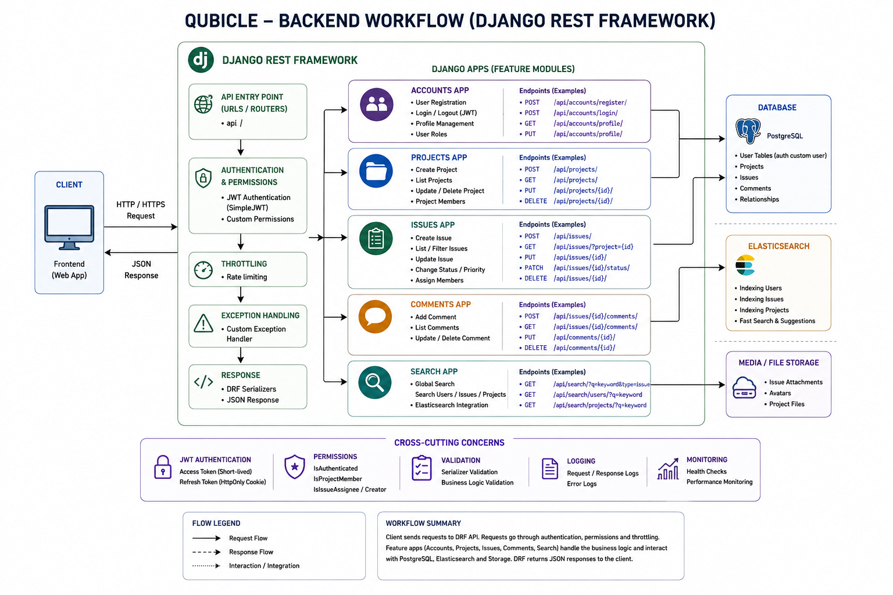
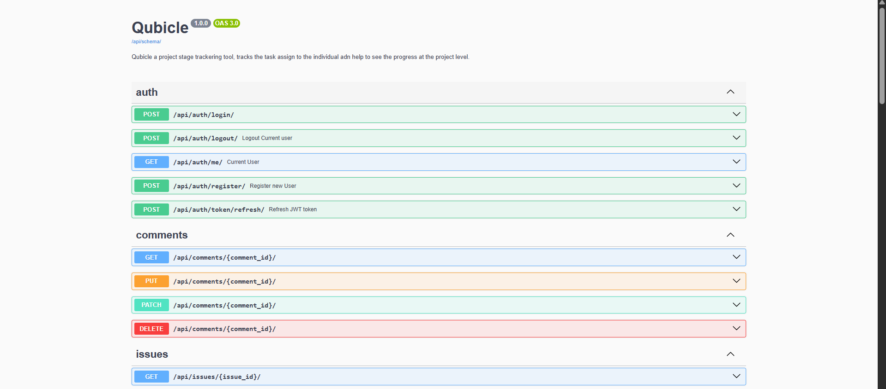
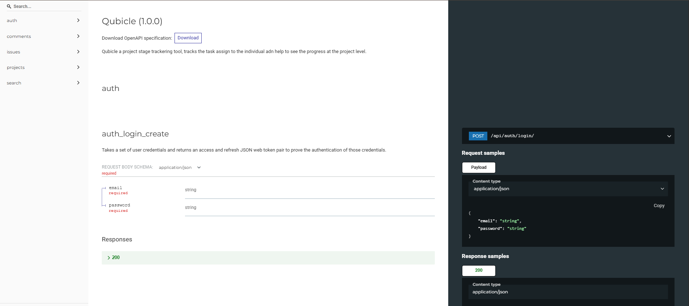

# Qubicle Backend

<p align="center">
  
  <span style="font-size: 32px; font-weight: bold;">Backend</span>
</p>

## Overview

Qubcile helps to orgainze the task related to a particular project at a single place you can hav ethe multiple task assigned to a single project and have the all task in eyes what is the progress of each task.  Tha backend mainly is a smartly build CRUD APIs.

## Features

- [x] **Authorization and Authentication**
- [x] **Project Dashboard Page**
- [x] **Interactive Status Board**
- [x] **Task Discussion Area**

## Tech Stack

- **Language: Python**
- **Framework: Django & Dnango Rest Framework**
- **Database: PostgresSQL**

## Project Structure

```text
backend/
|
|--.venv/                   # Virtual Environment
|--accounts/                # Authentication 
|   |
|   |--authentication.py
|   |--manager.py
|   |-- ...
| 
|--comments/                # Comments for isseu discussion
|   |
|   |-- permissions.py
|   |-- ...
|   
|--config/                  # Main project configuration 
|   |
|   |--asgi.py
|   |--config.py
|   |--settings.py
|   |--urls.py
|   |--wsgi.py
|   
|--issues/                  # Issues or Task 
|   |
|   |--signals.py
|   |-- ...
|
|--projects/                # Projects 
|   |
|   |--permissions.py
|   |--signals.py
|   |-- ...
|   
|--search/                  # Elastic search configurationa nd services
|   |
|   |--documents/
|   |--queries/
|   
|--.dockerignore
|--.env
|--.env.example
|--.gitignore
|--Dockerfile
|--manage.py                # Main entry and stating point
|--README.md
|--requirements.txt
```

## Request Flow

<p align="center">
  
</p>
<h3 align="center"><strong>Backend Data Flow</strong></h3>


## Database Design

<p align="center">
  
</p>
<h3 align="center"><strong>Core Domain Tables</strong></h3>


<p align="center">
  
</p>
<h3 align="center"><strong>User Relationship Tables</strong></h3>


## Setup 

- Enter in backend directory
```bash
cd backend
```

## Windows

### Datebase Setup

- This is only if you want to use the postgres service particularly
    1. Make a Databse in Postgres Server by any name of your choice lets giv it "Qubicle"
    2. Remember the all information about DB like url, db name, host, port 


### Environment Variables

1. Make a new file by the name ".env" 
2. Copy all content from the .env.example to .env 
3. Replace all value with your own values

```.env
ALLOWED_HOSTS=localhost,127.0.0.1
# your backend live link or keep it as it is if local

DB_NAME = "Qubicle"
DB_USERNAME = "postgres"
DB_PASSWORD = "admin"
DB_HOST = "localhost"
DB_PORT = 5432
# Enter your Db configuration values here these all ar ethe drfault localhost vlaues

SECRET_KEY=your_secret_key
DEBUG=True
# get these values from the config/settings.py or create your new one

ELASTICSEARCH_HOST=http://localhost:9200
# your ELK server link

FRONTEND_ORIGIN=http://localhost:5173
# your frontend live link
```

### Installation
Create Virtual Environment
```powershell
py -m venv .venv
```

Activate Environment
```powershell
.venv/Scripts/ACtivate
```

Installing requirements
```powershell
pip install -r requirements.txt
```

Run Database Migration
```poweshell
python manage.py makemigrations
```
```powershell
python manage.py migrate
```

Run server
```powershell
python manage.py runserver
```

### Linux & MacOS

Create Virtual Environment
```bash
python3 -m venv .venv
```

Activate Environment
```bash
source .venv/bin/activate
```

Installing requirements
```bash
pip3 install -r requirements.txt
```

Run Database Migrations
```bash
python3 manage.py makemigrations
```
```bash
python3 manage.py migrate
```

Run server
```bash
python3 manage.py runserver
```

### Docker Setup

1. Make sure docker is running in backeground 
2. make sure have Dockerfile in the working directory
3. Run this command
```bash
docker build -t qubicle-api .
```


### API documentation

- For the API documentation refer to the swagger documentation here 

```http
http://localhost:8000/api/schema/docs/

http://localhost:8000/api/schema/redocs/
```
⚠️This url will be change as per your system if you hosted or running it local. If it is local it will be at the same url as given other wise ther ewill be some domain at "localhost:8000" and instead of http it will be https

<p align="center">
  
</p>
<h3 align="center"><strong>Swagger Docs</strong></h3>


<p align="center">
  
</p>
<h3 align="center"><strong>Swagger Redocs</strong></h3>


## Author
***Hariom Gupta***
- Linkedin: [linkedin/hariom2809](https://www.linkedin.com/in/hariom2809/)