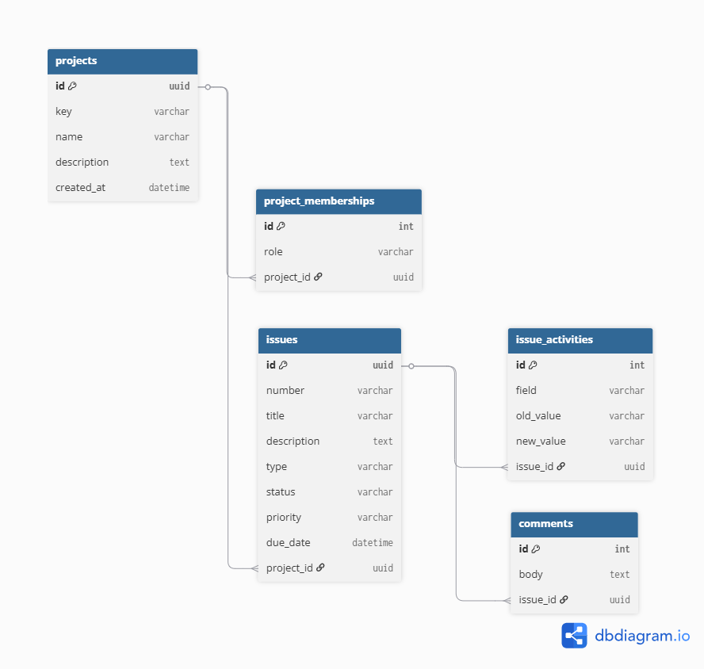
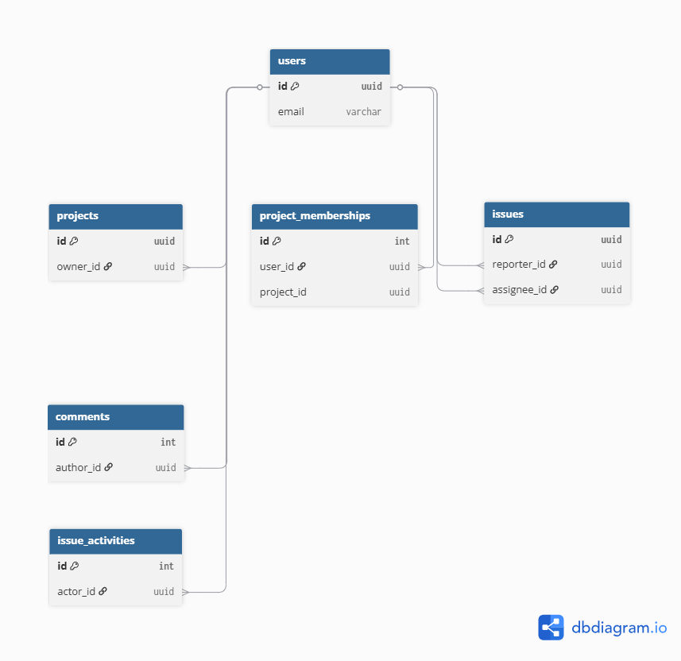

# Jira Clone Backend

## Overview

This project is the backend implementation for Jira, **Project Management Software**.  The Goal of the project is to have hands on Experience of Development in **Python Environment**.  

## Features

- [x] Done *User Authentication & Authorization*
- [x] Done *Create Project & Add project members*
- [x] Done *Report an Issue for project*
- [x] Done *Issue discussion on comments*

## Tech Stack

- *Language: Python*
- *Framework: Django & Dnango Rest Framework*
- *Database: SQLite3*

## Project Structure

```text
Jira-Clone-Backend/
|
|--.venv/
|--accounts/
|   |
|   |--authentication.py
|   |--manager.py
|   |-- ...
| 
|--comments/
|   |
|   |-- permissions.py
|   |-- ...
|   
|--config/
|   |
|   |--asgi.py
|   |--settings.py
|   |--urls.py
|   |--wsgi.py
|   
|--issues/
|   |
|   |--signals.py
|   |-- ...
|
|--projects/
|   |
|   |--permissions.py
|   |--signals.py
|   |-- ...
|   
|--.env
|--.gitignore
|--manage.py
|--README.md
|--requirements.txt
```

## Database Design



**Core Domain**

Core Business Tabels 



**User Relationship**

User relation to the other tables

## Installation

```bash
git clone https://github.com/hariom2809/Jira-Clone-Backend.git
cd Jira-Clone-Backend
```

### Windows

Create Virtual Environment
```powershell
py -m venv .venv
```

Activate Environment
```powershell
.venv/Scripts/ACtivate
```

Installing requirements
```powershell
pip install -r requirements.txt
```

Run server
```powershell
python manage.py runserver
```

### Linux & MacOS

Create Virtual Environment
```bash
python3 -m venv .venv
```

Activate Environment
```bash
source .venv/bin/activate
```

Installing requirements
```bash
pip3 install -r requirements.txt
```

Run server
```bash
python3 manage.py runserver
```

## Learnings

- Django Rest Framework in development
- Database Realtions
- Python OOPs usage in Development

## Author
***Hariom Gupta***
- Linkedin: [linkedin/hariom2809](https://www.linkedin.com/in/hariom2809/)