# Qubicle Frontend

<p align="center">
  
  <span style="font-size: 32px; font-weight: bold;">Frontend</span>
</p>

## Overview

React.js based application build to provide the UI for the project Qubicle. The code is very easy to understand and has the very easy to understand components and scalable feature which can be implemented any where and cna be reuse in the same project.  Qubicle provide very easy to use UI no extra effort to understand what a button will do and how to navigate thorugh an option it is very easy to understand.  You will get to know just by looking at it for oncce. 

## Tech Stack

- **Language: JavaScript**
- **Frontend Library: React.js**


## Folder Structure

```text
frontend
|
|--node_modules/
|--public/
|--src/                                 # Appication main source files
|   |
|   |--app/
|   |   |
|   |   |--api.js                      # Api initiaization Axios initialization
|   |   |--router.jsx                  # Router file definein gthe url routes for the project
|   |
|   |--components/
|   |   |
|   |   |--layout/                    # Layout Components for the base of the porject like Auth and Dashboard
|   |   |   |
|   |   |   |-- ...
|   |   |
|   |   |--ui/                        # All reuseable rect components which cna be used any where in the app
|   |       |
|   |       |-- ...
|   |   
|   |--constants/                    # Constants files use to have the fix value for certian options thorughout the project
|   |   |
|   |   |-- ...
|   |   
|   |--context/                     # All global contexts files 
|   |   |
|   |   |-- ...
|   |
|   |--features/                   # Everything related to each feature is being seperated in folder as by their names
|   |   |
|   |   |--activitylog/
|   |   |--auth/
|   |   |--comment/
|   |   |--issue/
|   |   |--kanban/
|   |   |--project/
|   |   
|   |--routes/                     # Routes protection and other routes related ifles
|   |   |
|   |   |-- ...
|   |   
|   |--utils/                    # Utility files JS fiels use to the custom functions 
|   |   |
|   |   |-- ...
|   |   
|   |--index.css
|   |--main.jsx                 # Main app setup point
|
|--.dockerignore
|--.env
|--.gitignore
|--Dockerfile
|--eslint.config.js
|--index.html                     # Min Entry Point of the Project
|--package-lock.json
|--package.json
|--README.md
|--vite.config.js
```

## UI overview

**Login**

<table>
  <tr>
    <td width="50%" align="center">
      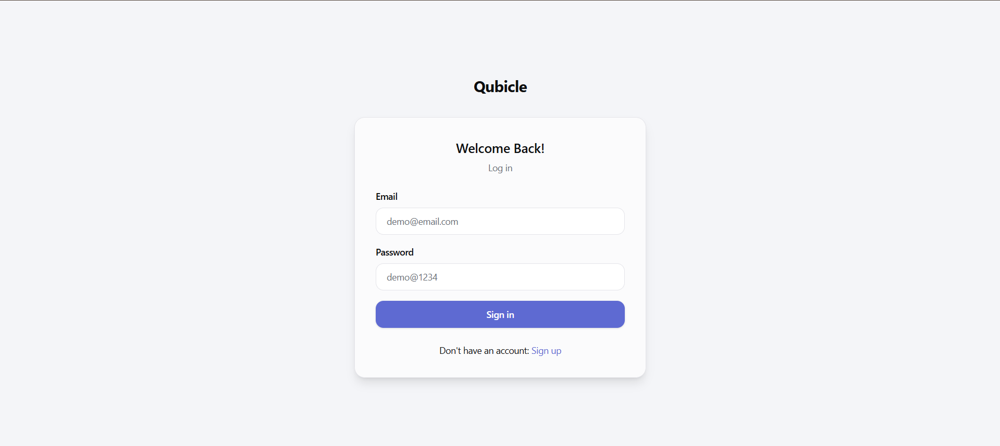
    </td>
    <td width="50%" align="center">
      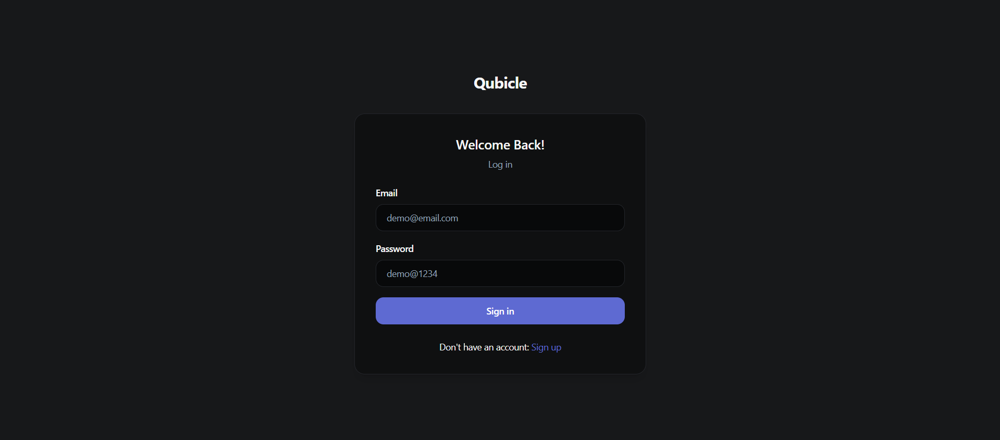
    </td>
  </tr>
</table>


***Register***

<table>
  <tr>
    <td width="50%" align="center">
      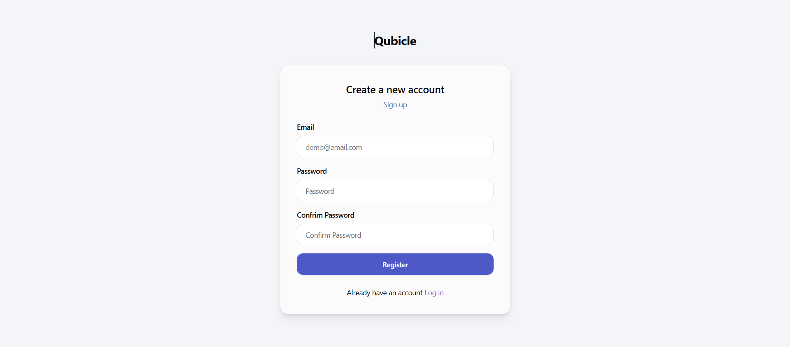
    </td>
    <td width="50%" align="center">
      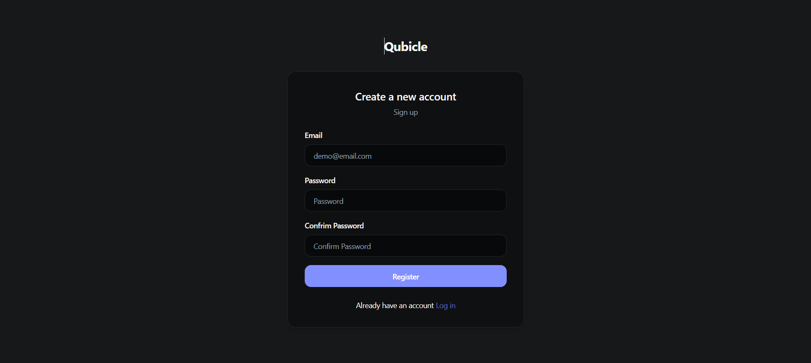
    </td>
  </tr>
</table>


***Dashboard***

<table>
  <tr>
    <td width="50%" align="center">
      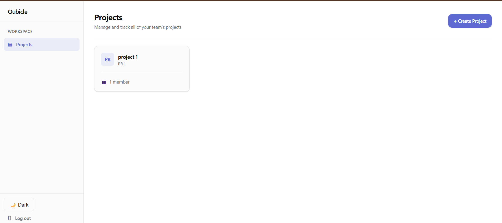
    </td>
    <td width="50%" align="center">
      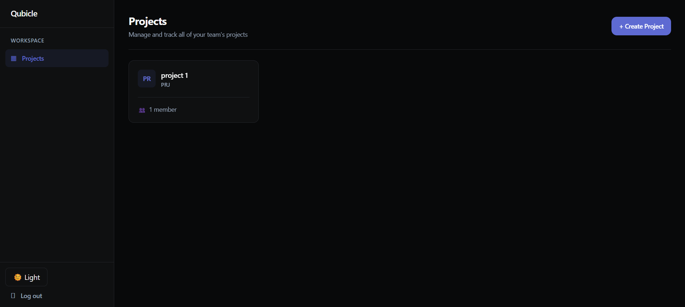
    </td>
  </tr>
</table>


***Create New Project***

<table>
  <tr>
    <td width="50%" align="center">
      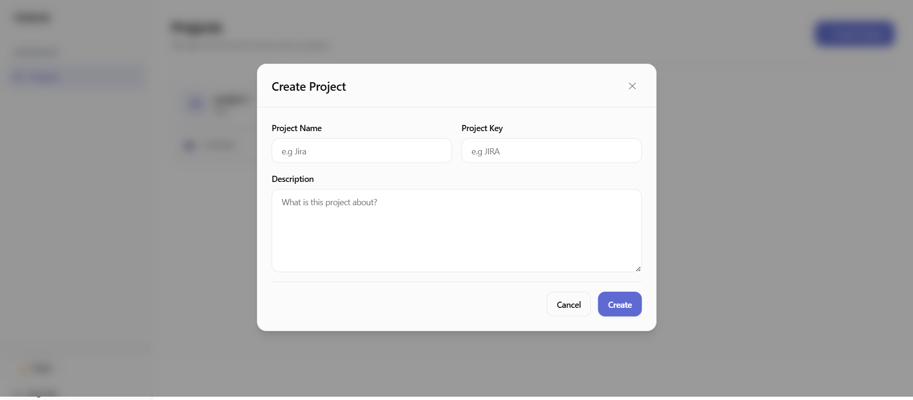
    </td>
    <td width="50%" align="center">
      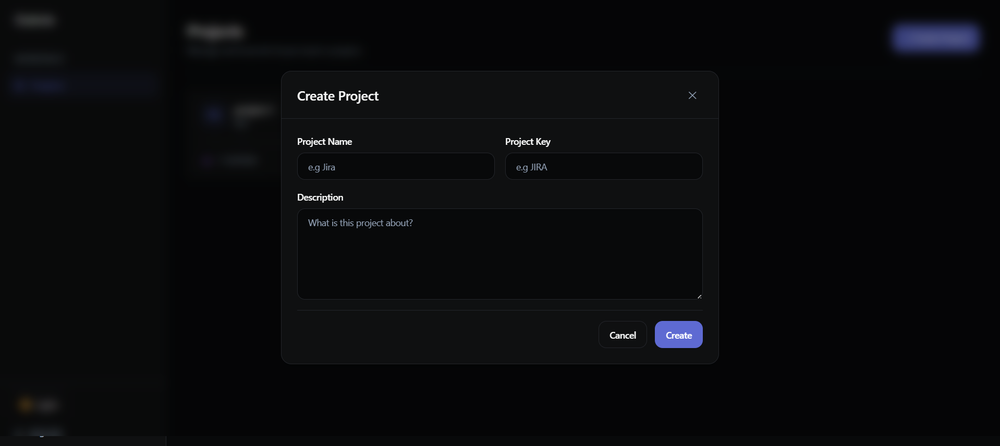
    </td>
  </tr>
</table>


***Project Overview***

<table>
  <tr>
    <td width="50%" align="center">
      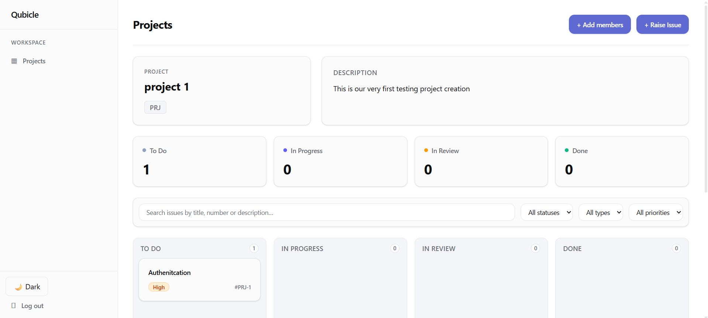
    </td>
    <td width="50%" align="center">
      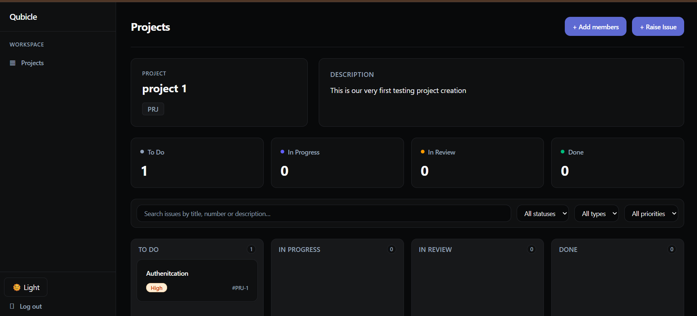
    </td>
  </tr>
</table>


***Ass member***

<table>
  <tr>
    <td width="50%" align="center">
      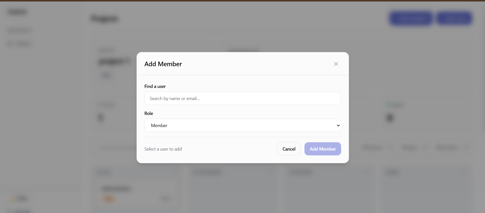
    </td>
    <td width="50%" align="center">
      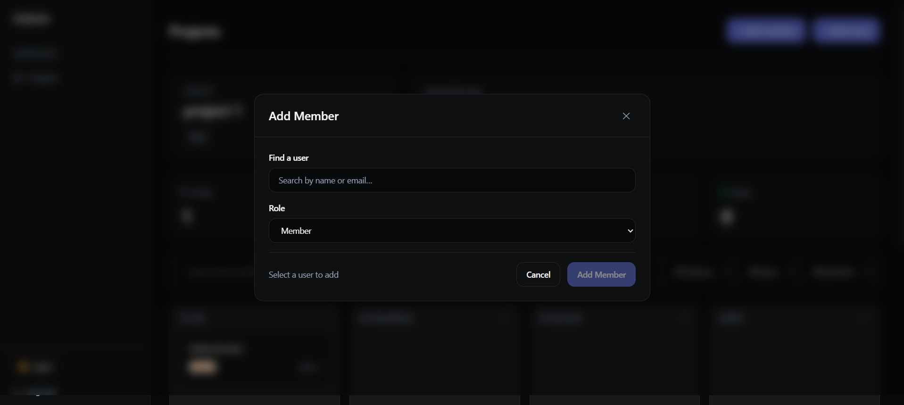
    </td>
  </tr>
</table>


***Register***

<table>
  <tr>
    <td width="50%" align="center">
      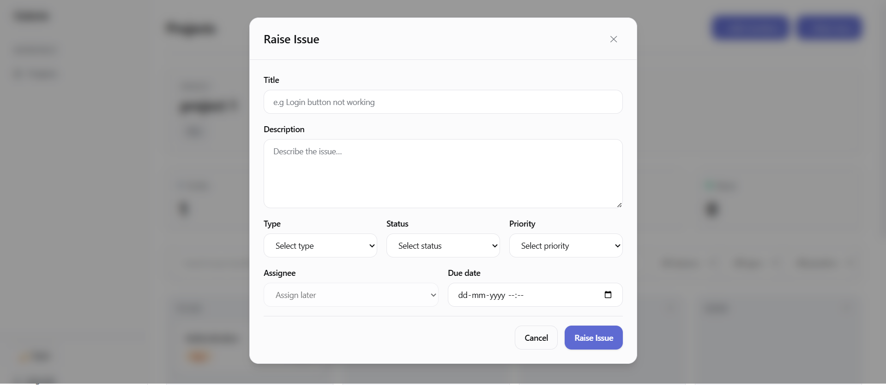
    </td>
    <td width="50%" align="center">
      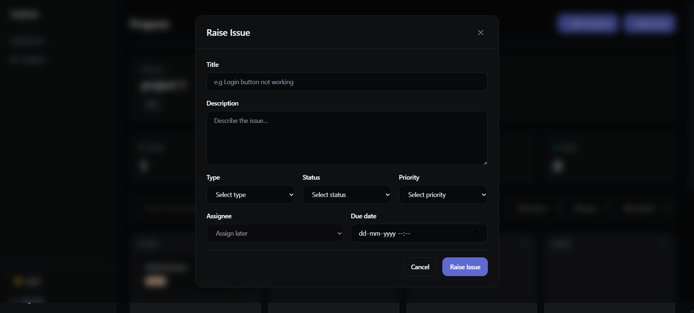
    </td>
  </tr>
</table>


***Issue Overview***

<table>
  <tr>
    <td width="50%" align="center">
      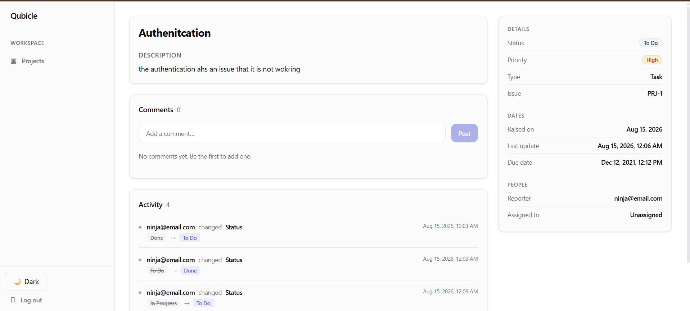
    </td>
    <td width="50%" align="center">
      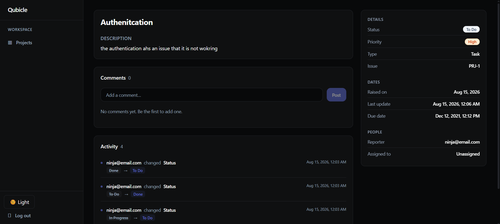
    </td>
  </tr>
</table>


## Setup

### Env Variable

For the environment variables you can see the file ".env.example" file make sure to have the "/api" at the end of your url will enter in .env

- Make a new file at the "/qubicle/frontend" by the name ".env"

```bash
touch .env
```

- Copy everything from the .env.example to youur new created .env file.
- Now provide the all required values for the required variabels

### Installation

- Make sure to enter in frontend folder. Path should look like ***/qubicle/frontend/ ***

```bash
cd frontend  
```

- Now install all the required libraires or dependencies.

```bash
npm install
```

- Now run the project

```bash
npm run dev
```

### Docker setup

- Make a your own docker iamge of code 

```bash
docker build --build-arg VITE_API_BASE_URL=https://localhost:8000/api -t qubicle-ui .
```

Make sure to change the localhost url with your live backend url if you are hosting it on serverinstead of localhost:8000 place your live link

## Author 
**Hariom Gupta**
- Linkedin: (https://www.linkedin.com/in/hariom2809)